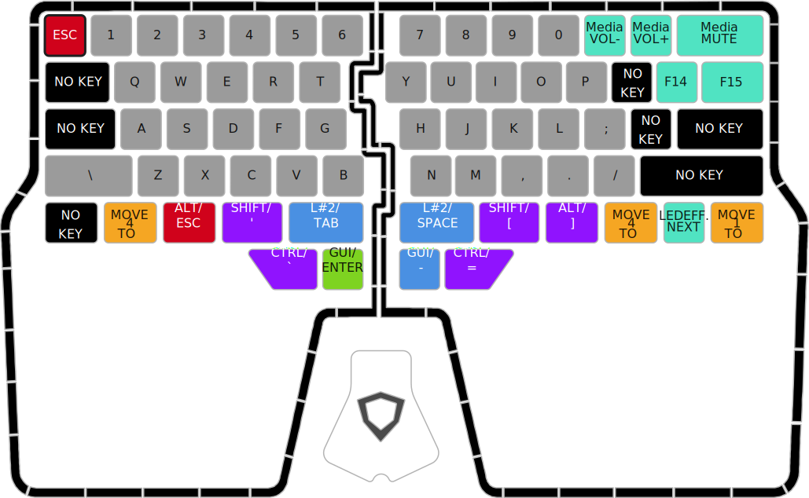
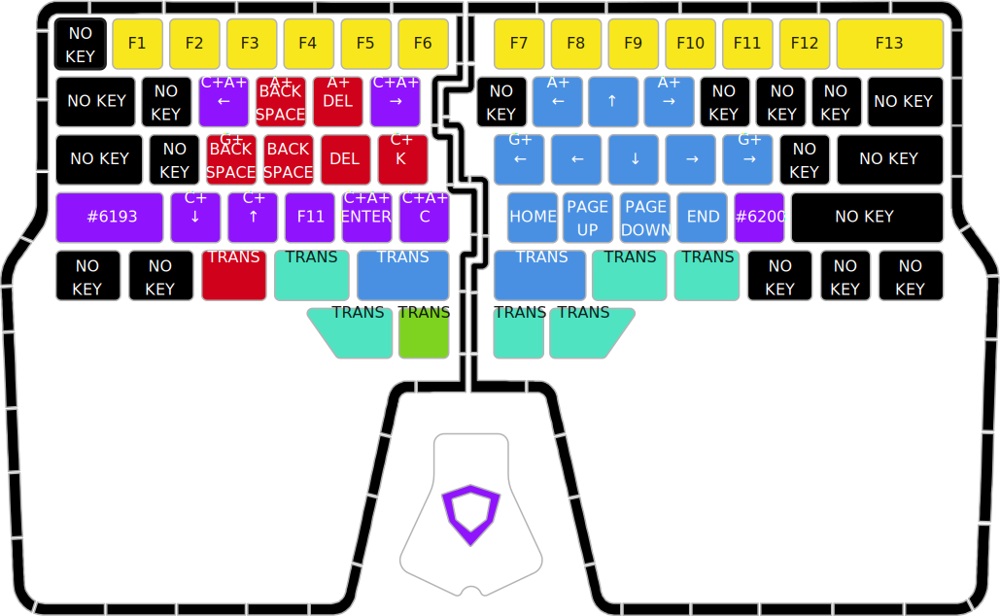

# Raise Ergo
An ergonomic keyboard layout for the Dygma Raise keyboard, geared towards programming and the
command line on macOS.

## Benefits/Design Principles
* QWERTY-based for ease of learning.
* Reduces stress on your pinkies by moving keys away from them and instead to your thumbs.
* Reduces discomfort from awkward key combinations by putting the modifier keys under your thumbs
  and finger tips.
  * Inserting emojis with <kbd>⌃</kbd><kbd>⌘</kbd><kbd>␣</kbd> has never been easier! 😜
* Reduces hand movement and increases data entry speed by having cursor keys, deletion keys and
  <kbd>↩︎</kbd> under your finger tips, plus <kbd>⇥</kbd> under your left thumb.
* Speeds up text editing by having dedicated keys for skipping/deleting words/lines under your
  finger tips.
* Keeps <kbd>`</kbd> near <kbd>⇥</kbd> and <kbd>⌃</kbd> near <kbd>⌘</kbd>, so you can easily
  * switch apps with <kbd>⌘</kbd><kbd>⇥</kbd>,
  * switch windows with <kbd>⌘</kbd><kbd>`</kbd>,
  * switch tabs with <kbd>⌃</kbd><kbd>⇥</kbd>.
* Decreases lateral finger travel and increases typing speed when programming by having word
  separators (<kbd>␣</kbd>, <kbd>-</kbd>, <kbd>\_</kbd>), quotation marks (<kbd>'</kbd>,
  <kbd>"</kbd>, <kbd>`</kbd>) and braces (<kbd>[</kbd>, <kbd>]</kbd>, <kbd>{</kbd>, <kbd>}</kbd>)
  under your thumbs. This also means you can more easily
  * navigate backward with <kbd>⌘</kbd><kbd>[</kbd>,
  * navigate forward with <kbd>⌘</kbd><kbd>]</kbd>,
  * zoom in with <kbd>⌘</kbd><kbd>-</kbd>,
  * zoom out with <kbd>⌘</kbd><kbd>=</kbd>, and
  * type `~` to go to your home dir with <kbd>⇧</kbd><kbd>`</kbd>.

## [Layer 0](layer0.json): Typing for macOS

### Dual keys (purple & teal)
| | <kbd>V</kbd> | <kbd>•••</kbd> | <kbd>••</kbd> | <kbd>•</kbd> | <kbd>⏤</kbd> | <kbd>⏤</kbd> | <kbd>•</kbd> | <kbd>••</kbd> | <kbd>•••</kbd> | <kbd>N</kbd> |
| --: | :-: | :-: | :-: | :-: | :-: | :-: | :-: | :-: | :-: | :-: |
| When held | <kbd>⌥</kbd> | <kbd>⇧</kbd> | <kbd>⌃</kbd> | <kbd>⌘</kbd> | Layer 1 | Layer 1 | <kbd>⌘</kbd> | <kbd>⌃</kbd> | <kbd>⇧</kbd> | <kbd>⌥</kbd> |
| Otherwise | <kbd>V</kbd> | <kbd>`</kbd> | <kbd>[</kbd> | <kbd>]</kbd> | <kbd>⇥</kbd> | <kbd>␣</kbd> | <kbd>-</kbd> | <kbd>=</kbd> | <kbd>'</kbd> | <kbd>N</kbd> |

### Special keys
| Key | Action |
| --: | :-- |
| <kbd>Scroll Lock</kbd> | Decrease display brightness |
| <kbd>Pause</kbd> | Increase display brightness |

## [Layer 1](layer1.json): Editing overlay for macOS

### Combo keys (blue & red)
| Key | Action |
| :-: | :-- |
| <kbd>U</kbd> / <kbd>O</kbd> | Move to beginning/end of word |
| <kbd>W</kbd> / <kbd>R</kbd> | Delete to beginning/end of word |
| <kbd>H</kbd> / <kbd>:</kbd> | Move to beginning/end of line |
| <kbd>A</kbd> / <kbd>G</kbd> | Delete to beginning/end of line |

## Author
© 2020 [Marlon Richert](https://github.com/marlonrichert)

## License
This project is licensed under the GPL-3.0 License. See the [LICENSE](LICENSE) file for details.
