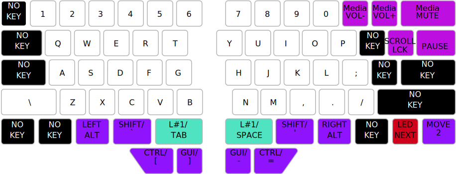

# Raise Ergo
An ergonomic keyboard layout for the Dygma Raise keyboard, geared towards programming and the
command line on macOS and Ubuntu.

## Benefits/Design Principles
* QWERTY-based for ease of learning.
* Reduces stress on your pinkies by moving keys away from them and instead to your thumbs.
* Reduces discomfort from awkward key combinations by putting the modifier keys under your thumbs
  and finger tips. Inserting emojis with <kbd>⌃</kbd><kbd>⌘</kbd><kbd>␣</kbd> has never been
  easier! 😜
* Reduces hand movement and increases data entry speed by having cursor keys, deletion keys and
  <kbd>↩︎</kbd> under your finger tips, plus <kbd>⇥</kbd> under your left thumb.
* Speeds up text editing by having dedicated keys for skipping/deleting words/lines under your
  finger tips.
* Keeps <kbd>`</kbd> near <kbd>⇥</kbd> and <kbd>⌃</kbd> near <kbd>⌘</kbd>, so you can easily
  * switch apps with <kbd>⌘</kbd><kbd>⇥</kbd>,
  * switch windows with <kbd>⌘</kbd><kbd>`</kbd>,
  * switch tabs with <kbd>⌃</kbd><kbd>⇥</kbd>.
* Makes it easier to do programming, use the command line and write Markdown, by having word
  separators (<kbd>␣</kbd>, <kbd>-</kbd>, <kbd>\_</kbd>), quotation marks (<kbd>'</kbd>,
  <kbd>"</kbd>, <kbd>`</kbd>) and braces (<kbd>[</kbd>, <kbd>]</kbd>, <kbd>{</kbd>, <kbd>}</kbd>)
  under your thumbs. This also means you can more easily
  * navigate backward with <kbd>⌘</kbd><kbd>[</kbd> & forward with <kbd>⌘</kbd><kbd>]</kbd>,
  * zoom in with <kbd>⌘</kbd><kbd>-</kbd> & out with <kbd>⌘</kbd><kbd>=</kbd>, and
  * type `~` to go to your home dir with <kbd>⇧</kbd><kbd>`</kbd>.

## [Layer 0](layer0.json): Typing keys for macOS

## [Layer 1](layer1.json): Editing keys for macOS

## [Layer 2](layer2.json): Typing keys for Ubuntu

## [Layer 3](layer3.json): Editing keys for Ubuntu

## [Layer 4](layer4.json): Editing keys for Ubuntu Terminal

## Author
© 2020-2021 [Marlon Richert](https://github.com/marlonrichert)

## License
This project is licensed under the GPL-3.0 License. See the [LICENSE](LICENSE) file for details.
