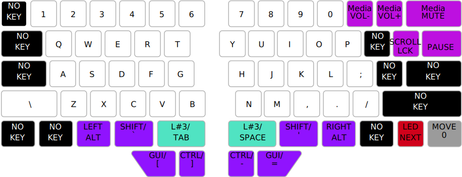
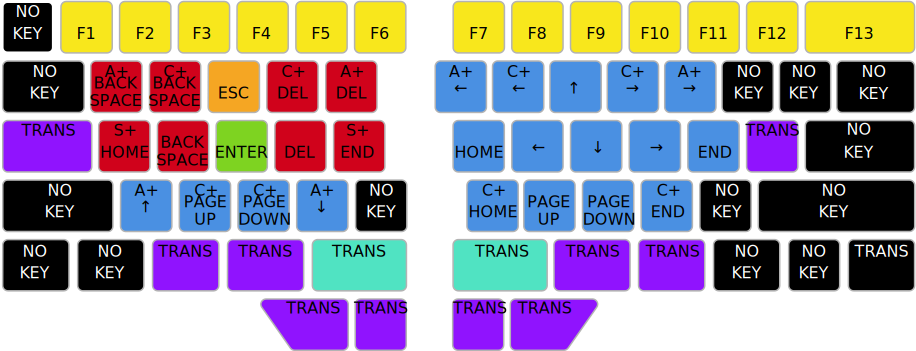

# Raise Ergo
An ergonomic keyboard layout for the Dygma Raise keyboard, geared towards programming and the
command line.

## Benefits

* QWERTY-based for ease of learning.
* Reduces stress on your pinkies by moving many keys away from them and instead to your thumbs.
* Reduces discomfort from awkward key combinations by putting the modifier keys under your thumbs
  and having dedicated keys for skipping/deleting words and lines.
* Reduces hand movement and increases data entry speed by having <kbd>tab</kbd> and
  <kbd>enter</kbd> under your thumbs, plus deletion and cursor movement keys under your finger tips (activated by your thumbs).
* Decreases finger travel and increases typing speed (especially when programming) by having all
  word separators (<kbd>space</kbd>, <kbd>hypen</kbd>, <kbd>underscore</kbd>) and quotation marks
  under your thumbs.

## Layers

* [Layer 0](layer0.json): Typing for macOS

  

* [Layer 1](layer1.json): Windows overlay for layer 0

  

* [Layer 2](layer2.json): Editing overlay for macOS

  

* [Layer 3](layer3.json): Editing overlay for Windows

  

* [Layer 4](layer4.json): Numeric overlay for macOS

  

* [Layer 5](layer5.json): Numeric overlay for Windows

  
